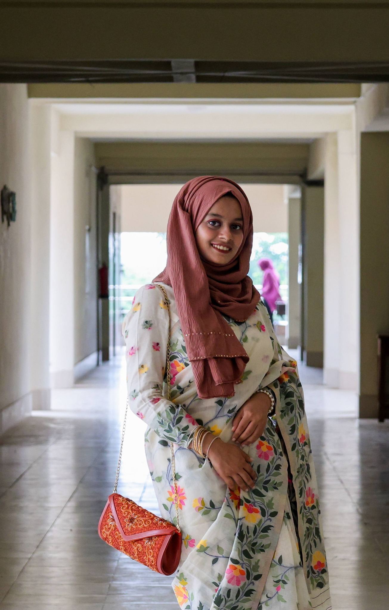

<!-- Dual profile photos -->
&nbsp;&nbsp;&nbsp;

 

# Sumaiya Rahim

**B.Sc. CSE · KUET, Bangladesh · 2026**

 

---

## About Me

CSE student at **KUET** working across AI research, backend engineering, and competitive programming. My research spans Medical AI, Reinforcement Learning, NLP, and Software Engineering — with three publications in SoftwareX (Elsevier) and IEEE venues. Outside the lab I build backend systems, explore distributed architecture, and mentor junior programmers in algorithmic problem-solving.

---

## Competitive Programming

| Contest | Year | Result |
|:--|:--:|:--|
| ICPC Asia Dhaka Regional | 2024 | Regional Contestant |
| National Girls Programming Contest | 2022 | Participant |
| CodeMania | 2023 | **🥇 Ranked 8th** |

---

## Research Publications

<table>
<tr>
<td width="33%" valign="top">

**📗 SoftwareX — Elsevier**

*GoRent: Open-Source Software for Transparent Rule-Based Rental Risk Assessment*

 

Open-source platform for interpretable, rule-based rental risk decisions.

</td>
<td width="33%" valign="top">

**📘 IEEE EICT**

*DSCBAM-Net: Lightweight Neural Network for Automated Brain Tumor Classification*

 

Efficient depthwise-separable + attention architecture for brain MRI classification.

</td>
<td width="33%" valign="top">

**📙 IEEE WIECON-ECE**

*Semi-Supervised Emotion Classification for Noisy Bangla Text*

 

Context-aware semi-supervised learning for low-resource Bangla emotion detection.

</td>
</tr>
</table>
## Current Research

<table>
<tr>
<td width="50%" valign="top">

**🥗 DietRL** — *RL-Based Personalized Diet Planning*

RL agents trained over **600+ Bangladesh-specific foods** with medical constraints and nutritional optimization for personalized meal plans.

  

</td>
<td width="50%" valign="top">

**🧬 Alzheimer's Review** — *DL for Disease Progression Modeling*

Review of diffusion models, GNNs, and survival models applied to longitudinal MRI for Alzheimer's progression modeling.

  

</td>
</tr>
</table>

---

## Featured Projects

<table>
<tr>
<td width="50%" valign="top">

**☁️ Cloud-Native App — GoRent Backend**

Backend service in Go with RESTful APIs and microservices architecture, deployed on Linux/Ubuntu.

  

</td>
<td width="50%" valign="top">

**🛒 Laravel E-Commerce Platform**

Scalable full-stack platform with authentication, product management, and admin dashboard using MVC.

 

</td>
</tr>
<tr>
<td width="50%" valign="top">

**🤝 Esale — E-Commerce System**

Team-built e-commerce system using GitHub for distributed development, code review, and agile workflows.

  

</td>
<td width="50%" valign="top">

**📱 MyLearningApp — Android App**

Android app for programming education with quiz functionality and clean UI design.

 

</td>
</tr>
</table>
---

## Technical Skills

**Languages**

**AI / ML**

**Frameworks & Backend**

**Tools**

---

## GitHub Statistics

 

 

 

<picture>
  <source media="(prefers-color-scheme: dark)" srcset="https://raw.githubusercontent.com/suma-iya/suma-iya/output/github-snake-dark.svg" />
  <source media="(prefers-color-scheme: light)" srcset="https://raw.githubusercontent.com/suma-iya/suma-iya/output/github-snake.svg" />
  
</picture>

---

## Connect

*Open to research collaborations, graduate studies, and backend / ML engineering roles.*

Researcher · Engineer · Problem Solver

